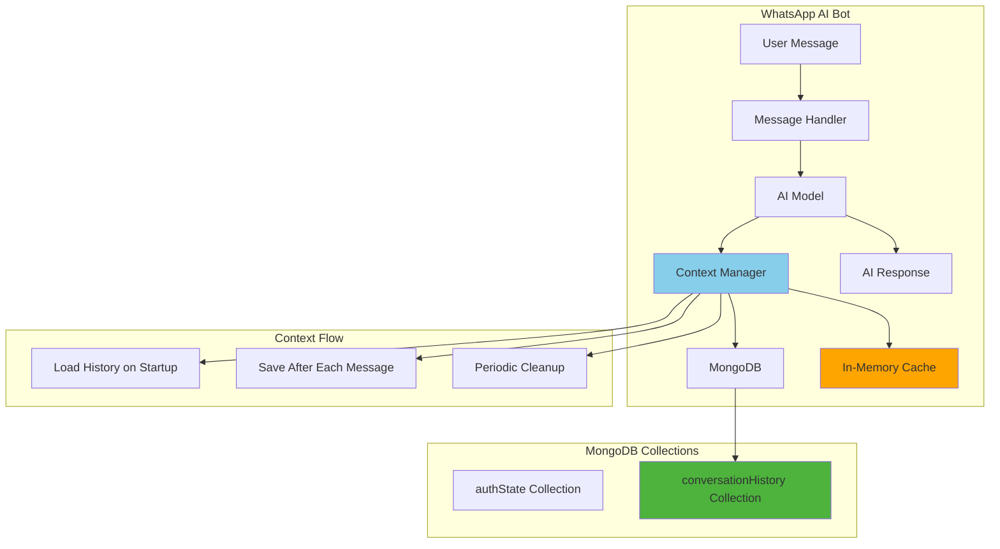

# AI Conversation History Persistence Implementation Plan

## Problem Analysis

**Root Cause**: The AI conversation history is stored in memory (in the [`history`](../src/models/BaseAiModel.ts:66) object of each AI model) and gets completely lost when Docker containers restart. Each AI model (ChatGPT, Gemini, etc.) maintains conversation context in memory only.

**Current State**: 
- ✅ WhatsApp session persistence is working via MongoDB
- ❌ AI conversation history is lost on every restart
- ❌ Users must start conversations from scratch after each restart

## Architecture Overview



## Implementation Strategy

### Phase 1: Database Schema Design

**New MongoDB Collection**: `conversationHistory`

```typescript
interface ConversationHistory {
  _id: string;
  userId: string;           // WhatsApp user ID
  modelName: string;        // 'ChatGPT', 'Gemini', etc.
  messages: Array<{
    role: 'user' | 'assistant' | 'system';
    content: string;
    timestamp: Date;
  }>;
  lastUpdated: Date;
  metadata?: {
    totalMessages: number;
    firstMessageDate: Date;
  };
}
```

### Phase 2: Context Manager Service

Create a new service to manage conversation persistence:

**File**: `src/services/ConversationHistoryManager.ts`

**Key Features**:
- Handle loading/saving conversation history
- Manage memory cache for performance
- Implement automatic cleanup for old conversations
- Lazy loading for performance optimization

### Phase 3: Base AI Model Enhancement

**Modify**: [`src/models/BaseAiModel.ts`](../src/models/BaseAiModel.ts:63)

**Changes**:
- Replace in-memory history with persistent storage calls
- Add methods for loading/saving history
- Maintain backward compatibility
- Integrate with Context Manager

### Phase 4: Database Integration

**Extend**: [`src/baileys/database/mongo.ts`](../src/baileys/database/mongo.ts:10)

**Changes**:
- Add new collection for conversation history
- Implement efficient querying and indexing
- Create database connection utilities

## Key Features

### 1. Automatic History Loading
- Load conversation history when user first interacts after restart
- Lazy loading for performance optimization
- Cache frequently accessed conversations

### 2. Real-time Persistence
- Save conversation after each AI interaction
- Batch updates for performance
- Atomic database operations

### 3. Memory Management
- LRU cache for active conversations
- Configurable history length limits
- Automatic cleanup of old conversations

### 4. Multi-Model Support
- Separate history per AI model per user
- Cross-model conversation isolation
- Model-specific configuration

## Configuration Options

### Environment Variables (to add to `.env`)

```env
# Conversation History Settings
CONVERSATION_HISTORY_ENABLED=true
CONVERSATION_MAX_MESSAGES=100
CONVERSATION_CLEANUP_DAYS=30
CONVERSATION_CACHE_SIZE=1000
```

### Configuration Details

- `CONVERSATION_HISTORY_ENABLED`: Enable/disable conversation persistence
- `CONVERSATION_MAX_MESSAGES`: Maximum messages to keep per conversation
- `CONVERSATION_CLEANUP_DAYS`: Auto-delete conversations older than X days
- `CONVERSATION_CACHE_SIZE`: Number of conversations to keep in memory cache

## Performance Optimizations

### 1. Caching Strategy
- Keep active conversations in memory
- MongoDB as persistent backup
- Configurable cache size
- LRU eviction policy

### 2. Database Optimizations
- Composite indexes on `{userId, modelName}`
- TTL index for automatic cleanup
- Efficient query patterns
- Connection pooling

### 3. Memory Management
- Limit conversation history length
- Periodic garbage collection
- Async save operations
- Batch database operations

## Implementation Steps

### Step 1: Create Context Manager Service (5 mins)
- Create `ConversationHistoryManager.ts`
- Implement cache management
- Add database operations

### Step 2: Enhance Base AI Model (10 mins)
- Modify `BaseAiModel.ts`
- Replace memory storage
- Add persistence methods

### Step 3: Update Database Schema (5 mins)
- Extend MongoDB connection
- Create new collection
- Add indexes

### Step 4: Integrate with Message Handlers (5 mins)
- Update message processing
- Add context loading/saving
- Handle edge cases

### Step 5: Add Configuration & Testing (10 mins)
- Add environment variables
- Create test scenarios
- Verify functionality

**Total Estimated Time**: 35-40 minutes

## Benefits

### User Experience
- ✅ Conversations continue seamlessly after restarts
- ✅ No loss of context or conversation flow
- ✅ Better AI responses due to maintained context
- ✅ Multi-device conversation sync

### System Reliability
- ✅ Atomic database operations
- ✅ Crash-resistant conversation storage
- ✅ Scalable across multiple containers
- ✅ Automatic data recovery

### Maintenance
- ✅ Automatic cleanup of old conversations
- ✅ Configurable retention policies
- ✅ Monitoring and analytics capabilities
- ✅ Performance optimization

## Testing Strategy

### 1. Conversation Persistence Test
```bash
# Start bot and have conversation with AI
docker-compose up -d

# Have AI conversation
# Send: !gpt Hello, remember my name is John

# Docker restart
docker-compose down && docker-compose up -d

# Continue conversation - should maintain context
# Send: !gpt What's my name?
# Expected: Should remember "John"
```

### 2. Memory Management Test
1. Create multiple long conversations
2. Verify memory usage stays within limits
3. Check database storage efficiency
4. Monitor cache hit/miss ratios

### 3. Multi-User Test
1. Multiple users with different AI models
2. Verify conversation isolation
3. Check concurrent access handling
4. Test different model types

### 4. Performance Test
1. Load test with many concurrent users
2. Measure response times
3. Monitor database performance
4. Verify cache effectiveness

## Security Considerations

### 1. Data Privacy
- Conversation data is encrypted at rest in MongoDB
- User data isolation per conversation
- Configurable data retention policies

### 2. Access Control
- User conversations only accessible by the same user
- Model-specific access controls
- Administrative cleanup capabilities

### 3. Data Protection
- Regular backup recommendations
- GDPR compliance considerations
- Data anonymization options

## Rollback Plan

If issues occur:

### 1. Immediate Rollback
```env
# In .env file
CONVERSATION_HISTORY_ENABLED=false

# Restart services
docker-compose down && docker-compose up -d
```

### 2. Data Recovery
- Conversation data remains in MongoDB
- Can re-enable feature after fixes
- No data loss during rollback

## Maintenance

### 1. Regular Monitoring
```bash
# Check conversation collection size
docker-compose exec mongodb mongosh whatsapp_sessions
db.conversationHistory.stats()

# Monitor active conversations
db.conversationHistory.find({lastUpdated: {$gte: new Date(Date.now() - 24*60*60*1000)}}).count()
```

### 2. Performance Tuning
- Monitor query performance
- Adjust cache sizes based on usage
- Optimize database indexes
- Regular performance reviews

### 3. Data Cleanup
- Automatic cleanup via TTL indexes
- Manual cleanup for large datasets
- Archive old conversations
- Monitor storage usage

## Expected Outcomes

After implementation:
- ✅ AI conversations persist across container restarts
- ✅ Users maintain context seamlessly
- ✅ Better AI conversation quality
- ✅ Improved user experience
- ✅ Scalable conversation storage
- ✅ Optimized memory and database usage

## Implementation Files to Create/Modify

### New Files
1. `src/services/ConversationHistoryManager.ts` - Main context manager
2. `src/types/ConversationHistory.d.ts` - Type definitions

### Modified Files
1. `src/models/BaseAiModel.ts` - Add persistence integration
2. `src/baileys/database/mongo.ts` - Extend database connection
3. `.env` - Add configuration variables

## Post-Implementation Verification

### Success Criteria
1. ✅ Conversations persist after `docker-compose down && up`
2. ✅ Memory usage remains stable under load
3. ✅ Database queries are performant
4. ✅ Multiple users can have concurrent conversations
5. ✅ Old conversations are automatically cleaned up
6. ✅ System handles edge cases gracefully

This plan ensures your WhatsApp AI bot will maintain conversation context across all restarts while providing optimal performance and reliability.